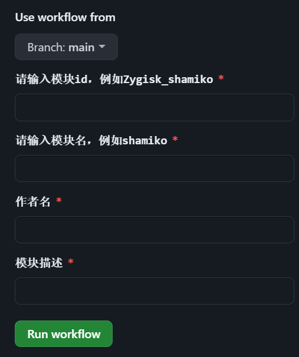
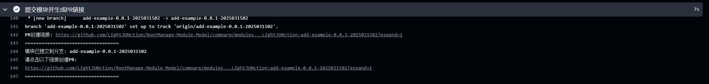

# RootManage-Module-Model
[](https://github.com/LIghtJUNction)
[](https://github.com/LIghtJUNction/RootManage-Module-Model/releases)
[](https://github.com/LIghtJUNction/RootManage-Module-Model/releases/latest)
[](https://choosealicense.com/licenses/gpl-3.0)


[](https://github.com/LIghtJUNction/RootManage-Module-Model/)

## MyModule 文件夹

> 在此处编辑模块内容

## 初始化[](https://github.com/LIghtJUNction/KernelSu-Module-Model-/actions/workflows/Initial.yml)

> 请点击action板块运行initial工作流



## release my module[](https://github.com/LIghtJUNction/KernelSu-Module-Model-/actions/workflows/release%20my%20module.yml)

> 只需填写版本号（标签tag）即可一键打包MyModule下的文件

```
在本工作流代码部分找到并按照自己喜好的格式修改
可用的部分变量如下
env.id----------安装后将是文件夹名字，如Zygisk_shamiko
env.name--------安装后将是模块名，例如shamiko
env.version-----当前模块版本号
env.versionCode-默认是年份+月份+日期+序列号 01-99 一天最多发布99个版本
env.author------模块作者
env.description-模块描述
默认命名格式如下（文件位置：.github\workflows\release my module.yml）
${{ env.name }}-${{ env.version }}-${{ env.versionCode }}-by${{ env.author }}.zip
```

## CHANGELOG.md

> 这里需要手动记录你的更改
>
> 请把高版本写在上面
>
> 每次发布更新前写好

## update.json

> 无需手动填写，工作流自动更新

## 友情链接
[模块仓库](https://github.com/LIghtJUNction/RootManage-Module-Model/modules)

# *# 开始编写模块*

1. 复刻(Fork)本项目
2. 点击ation
3. 运行initial工作流
4. 点击MyModule模块文件夹，按照说明要求编写模块
5. 点击运行action里的release工作流，自动打包发布

6. 输入标签为debug : 不发布release

## 贡献指南(分享模块)
1. 运行release工作流发布模块

2. 下载资产(包含pr链接) 或者 查看release工作流运行步骤: 提交模块并生成pr链接. 你制作的模块将会上传至[模块仓库](https://github.com/LIghtJUNction/RootManage-Module-Model/modules)


# 注意事项
> 1.请不要给MyModule改名，如要改名，请自行修改工作流，将关键字MyModule修改为你想要的名字（没有必要，因为最终安装在手机上，在data/adb/modules/模块id文件夹，MyModule这个名字只是在github库里方便标识文件路径，并不影响）
/
> 2.作者本人编写的模块将放在本项目新分支，运行action时先点击切换分支，否则默认打包main分支的模块

## Stargazers over time
[](https://starchart.cc/LIghtJUNction/RootManage-Module-Model)
